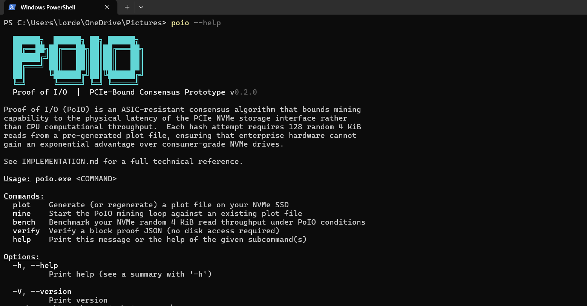

# Proof of I/O (PoIO): A Read-Bound Hashing Algorithm for Hardware-Equitable Consensus

[](https://www.rust-lang.org/)
[]()
[]()

## 1. Overview

Proof of I/O (PoIO) is an ASIC-resistant, hardware-equitable consensus algorithm that replaces traditional computational bottlenecks (CPU/GPU hashing) or static capacity bottlenecks (Proof of Space) with storage **I/O latency constraints**. By anchoring mining capability to the physical limitations of motherboard hardware interfaces (the NVMe-to-PCIe bus), PoIO prevents the centralization of mining power in industrial server farms and specialized custom computing chips.



> [!NOTE]
> **Global Installation (Windows 11)**
>
> **Option A — Installer (recommended).** Download **`PoIO-Setup-0.3.0.exe`** from the [latest release](https://github.com/Abdullah-Masood-05/PoIO-Consensus-Algorithm/releases/latest) and run it. The wizard installs `poio.exe` per‑user (no administrator prompt) and registers it on your `PATH`. Restart your terminal, then run `poio --help`.
>
> **Option B — PowerShell one‑liner.** To download and register the prebuilt binary automatically, open a standard PowerShell terminal and run:
> ```powershell
> irm "https://raw.githubusercontent.com/Abdullah-Masood-05/PoIO-Consensus-Algorithm/main/release/install.ps1" | iex
> ```
> Restart the terminal afterwards so the updated `PATH` takes effect.

---

## 2. The Core Problem We Are Addressing

Traditional consensus mechanisms suffer from systemic hardware centralization:

| Consensus Mechanism | Core Bottleneck | Decentralization Vulnerability |
| :--- | :--- | :--- |
| **Proof-of-Work (PoW)** | CPU / GPU Cryptographic Hashing | **ASIC Dominance**: Wealthy miners design custom application-specific integrated circuits that process calculations millions of times faster than standard consumer CPUs. |
| **Memory-Hard PoW** | DRAM Bandwidth Limits | **HBM Architectures**: Industrial entities leverage high-end enterprise graphics accelerators equipped with massive High Bandwidth Memory (HBM3) to bypass consumer DRAM channels. |
| **Proof-of-Space (PoSpace)** | Static Hard Drive Allocation | **Time-Memory Tradeoffs**: Wealthy miners use ultra-fast processors to calculate block plots on-the-fly right when a challenge occurs, completely dodging the static storage cost. |

### The PoIO Solution

By enforcing **128 randomized 4 KB sector reads** per single hash attempt, the bottleneck is shifted to the motherboard's physical hardware lanes. Because consumer NVMe drives operate at nearly the same physical random read cell latency (~90-110 microseconds) as top-tier datacentre enterprise SSDs (~60-80 microseconds), the playground is physically democratized. Industrial scaling yields only marginal, sub-linear advantages.

**Enforcing the bottleneck at runtime.** The entire model collapses if a miner can stage the plot in DRAM, so the reference implementation does not take plot sizing on trust. Before generating a plot it reads the host's hardware profile — total physical RAM and free disk space — directly from the operating system (`core/system.rs`: `GlobalMemoryStatusEx` on Windows, `/proc/meminfo` on Linux, `sysctl` on macOS). It refuses to silently create a plot small enough to live in a RAM‑disk, holding the line at a minimum of **2× detected RAM**, and aborts when the target volume lacks the free space to hold the file. This turns hardware‑equity from a paper property into an enforced precondition (detailed in [§7 — System‑Level Safety Checks](#7-security-and-attack-mitigations)).

---

## 3. Detailed File Architecture & Working

The codebase is engineered to be highly modular, production-ready, and free of runtime heap allocations inside the performance-critical hot paths.

```
proof_of_io/
├── Cargo.toml                 # Production dependencies & optimized compiler profiles
├── IMPLEMENTATION.md          # In-depth architectural & math reference guide
├── RELEVANCE.md               # Social, environmental & technical justification thesis
├── README.md                  # This documentation file
└── src/
    ├── main.rs                # CLI entry point, telemetry thread orchestration &  handlers
    └── core/
        ├── mod.rs             # Module definitions & structural exposure
        ├── crypto.rs          # Low-overhead Blake3 hashing & asymmetric proof verification
        ├── mod.rs             # Module definitions & structural exposure
        ├── disk.rs            # Platform-aware cache-bypassing direct file systems
        ├── plot.rs            # Multi-megabyte buffered plot creation with progress 
        ├── system.rs          # System RAM & free‑disk detection with safety warnings
        ├── mod.rs             # Module definitions & structural exposure
        ├── miner.rs           # Work‑stealing Rayon parallel mining engine (telemetry, IOPS)
        └── bench.rs           # Diagnostic random I/O storage benchmark suite
```

### File-by-File Working Reference

#### [src/main.rs](file:///c:/Users/lorde/OneDrive/Pictures/PoIO-Consensus-Algorithm/src/main.rs)
Acts as the central orchestrator. It parses CLI arguments using the modern `clap` subcommands structure, handles graceful shutdowns through the `ctrlc` signal interceptor, and hosts an asynchronous background progress thread that calculates real-time mining speed metrics (IOPS & H/s) without blocking worker threads.

#### [src/core/mod.rs](file:///c:/Users/lorde/OneDrive/Pictures/PoIO-Consensus-Algorithm/src/core/mod.rs)
Exposes the core submodules cleanly to the binary layer, ensuring a modular structural separations of concerns.

#### [src/core/crypto.rs](file:///c:/Users/lorde/OneDrive/Pictures/PoIO-Consensus-Algorithm/src/core/crypto.rs)
Contains cryptographic primitives. Wraps the blazing-fast `Blake3` streaming hasher. 
- Implements `derive_seed()` to lock challenges to block headers.
- Implements `generate_chunk_indices()` to deterministically maps a seed to 128 pseudo-random indices.
- Implements `verify_block_proof()` which performs **asymmetric verification**. This is the key to network viability: light nodes can instantaneously verify a block proof purely in-memory using CPU re-hashing *without needing to store the large plot file or issue a single disk seek*.

#### [src/core/disk.rs](file:///c:/Users/lorde/OneDrive/Pictures/PoIO-Consensus-Algorithm/src/core/disk.rs)
Manages low-level, hardware-direct file access. It contains platform-aware kernel optimizations to completely bypass the operating system's RAM page-cache:
- **Windows**: Opens plot files utilizing `FILE_FLAG_NO_BUFFERING` via registry options.
- **Linux**: Opens plots utilizing Unix-native `O_DIRECT`.
- **macOS**: Applies `fcntl` with `F_NOCACHE` directly to raw file descriptors.
This ensures every single read translates to a physical PCIe interface request instead of an instant RAM retrieval.

#### [src/core/system.rs](file:///c:/Users/lorde/OneDrive/Pictures/PoIO-Consensus-Algorithm/src/core/system.rs)
System module provides platform‑aware detection of total physical RAM and free disk space. The CLI uses this to emit warnings when the generated plot could fit entirely in RAM (potential ram‑disk attack) and to advise on available storage before plotting.
Performs plot generation. It streams high-entropy bytes from a genesis seed using `ChaCha8Rng` into a `BufWriter` pre-allocated to 4 MiB chunks to maximize drive write speeds. It renders an active progress bar and checks existing plot sizes to avoid redundant rewrites.

#### [src/core/miner.rs](file:///c:/Users/lorde/OneDrive/Pictures/PoIO-Consensus-Algorithm/src/core/miner.rs)
Houses the hot mining loop. Under the hood, it spins up a custom `rayon` thread pool. Crucially:
- Each worker thread opens its own independent, unique read handle to the plot file to prevent lock contention on seek coordinates.
- Allocates stack-based buffers (`[u8; 4096]`) to eliminate dynamic memory allocations.
- Employs lock-free atomic states (`AtomicU64`) to safely pass telemetry to the display thread.

#### [src/core/bench.rs](file:///c:/Users/lorde/OneDrive/Pictures/PoIO-Consensus-Algorithm/src/core/bench.rs)
Implements a storage latency diagnostic benchmark. It executes 1,024 random aligned 4 KiB reads under direct cache-bypassed conditions to construct a latency performance profile.


## How to Use — Step by Step

### Prerequisites

```powershell
rustc --version   # 1.75+
cargo --version
```

### Step 1 — Build the release binary

```powershell
cargo build --release
# Binary: target\release\poio.exe
```

### Step 2 — Generate a plot file (50 MB demo)

```powershell
cargo run --release -- plot --size 52428800 --path .\poio.plot
# Add --force to overwrite an existing plot and trigger system RAM \& disk checks
```

Expected output:
```
  Generating plot: 52428800 bytes -> "./poio.plot"
  [00:00:01] ████████████████████████████████████████████ 50.0 MiB / 50.0 MiB
  Plot ready in 1.234s
```

### Step 3 — Run the miner (easy difficulty for demo)

```powershell
cargo run --release -- mine --difficulty 4 --threads 4
```

Expected output:
```
  Plot     : "./poio.plot"  (12800 chunks)
  Difficulty: 4 leading zero bits
  Threads  : 4

  Attempts:     47  |  43.21 h/s  |  5531 IOPS

  BLOCK found!
  Nonce      : 23
  Hash       : 0d3f8a2b...
  Elapsed    : 0.541s
  Attempts   : 47
  Throughput : 43.21 h/s  |  5531 IOPS
```

> **Note:** The `plot` subcommand now performs runtime checks of total physical RAM and available disk space via the `core/system.rs` module. It warns if the requested plot size could fit entirely in RAM (potential ram‑disk attack) and aborts with an informative error when free storage is insufficient.

### Step 4 — Save and verify the proof

```powershell
# Mine and export proof JSON
cargo run --release -- mine --difficulty 4 --proof-out .\proof.json

# Verify without touching the plot file
cargo run --release -- verify --proof .\proof.json --difficulty 4
```

Expected verification output:
```
  Proof is VALID - all 128 chunk indices match deterministic derivation
  Hash satisfies difficulty 4
```

### Step 5 — Benchmark your NVMe drive

```powershell
cargo run --release -- bench --path .\poio.plot --size 52428800
```

---

### 5. How the Algorithm Works

```
                        [ Block Header ∥ Nonce ]
                                   │
                                   ▼
                         Blake3 Seed Derivation
                                   │
                                   ▼
                       Deterministic Index Generator
                         (128 Offsets via ChaCha8)
                                   │
                     ┌─────────────┴─────────────┐
                     ▼                           ▼
            OS Page Cache Bypass        OS Page Cache Bypass
             (FILE_FLAG_NO_BUFF)             (O_DIRECT)
                     │                           │
                     └─────────────┬─────────────┘
                                   ▼
                       Physical NVMe Motherboard Lanes
                                   │
                                   ▼
                       Read 128 x 4 KiB Data Blocks
                                   │
                                   ▼
                        Blake3 Cryptographic Hash
                                   │
                                   ▼
                             Target Met?
                             /         \
                           YES          NO
                           /             \
                  Broadcast Proof      Increment Nonce
```

---

## 5. Subcommands & Quick Start Guide

### Compilation

Build the release binary utilizing aggressive compiler and link-time optimizations:
```powershell
cargo build --release
```

### 1. `plot` — Generate a Plot File
Generates a highly-entropy pseudo-random dataset on your storage media with automatic system safety checks.
```powershell
# Generate a plot with automatic RAM detection and interactive sizing
cargo run --release -- plot --path .\poio.plot --force
```
- `--path`: Destination location (required).
- `--size`: (Optional) Total bytes in bytes (must be a multiple of 4096). If omitted, auto-detects system RAM.
- `--force`: Overwrite an existing plot file and trigger interactive mode for sizing selection.

**Interactive Mode Behavior** (when `--force` is used without `--size`):

When you run the command with `--force`, the system automatically detects your total physical RAM and calculates the minimum safe plot size (2× RAM to prevent RAM-disk attacks). You will be prompted to choose:

```
Type 'proceed' to create the full {size} GiB plot (ramdisk-safe)
Type 'safe' to create a 50 MB demo plot (for testing only)
```

**Example with full plot generation:**
```powershell
cargo run --release -- plot --path .\poio.plot --force
```

Output:
```
[ Plot Generation ]
  System RAM: 63.2 GiB
  INFO: No --size specified. Detected system RAM: 63.2 GiB.
  Minimum safe plot size (2× RAM) = 126.4 GiB

  Type 'proceed' to create the full 126.4 GiB plot (ramdisk-safe)
  Type 'safe' to create a 50 MB demo plot (for testing only)
  > proceed
  Path     : ".\poio.plot"
  Size     : 135738957824 bytes  (126.4 GiB)
  Genesis  : 0000000000000000
  Chunks   : 33139394

  Generating plot: 135738957824 bytes → ".\poio.plot"
  [00:00:01] ▊                                             2.26 GiB/126.42 GiB (1.93 GiB/s) ETA 64s
```

**Example with demo plot:**
```
  > safe
  Path     : ".\poio.plot"
  Size     : 52428800 bytes  (50.0 MiB)
  Genesis  : 0000000000000000
  Chunks   : 12800

  Generating plot: 52428800 bytes → ".\poio.plot"
  [00:00:00] █████████████████████████████████████████████ 50.00 MiB/50.00 MiB (1.58 GiB/s) ETA 0s
  ✓ Plot ready in 0.032s
```

### 2. `mine` — Start the Mining Process
Begins seeking block proofs using the multi-threaded search engine.
```powershell
# Mine with difficulty target of 4 leading zero bits across 4 CPU threads
cargo run --release -- mine --path .\poio.plot --threads 4 --difficulty 4 --proof-out .\proof.json
```
- `--difficulty`: Number of leading zero bits the hash must contain.
- `--threads`: Parallel execution threads (defaults to logical CPU count).
- `--proof-out`: Target JSON file path to export the winning proof parameters.

### 3. `verify` — Asymmetric Validation
Validates an exported block proof instantly in RAM.
```powershell
# Verify the block without accessing disk
cargo run --release -- verify --proof .\proof.json --difficulty 4
```
- `--proof`: Path to exported proof JSON document.
- `--difficulty`: The difficulty target threshold.

### 4. `bench` — NVMe Benchmark Target
Diagnoses your hard disk capability to assess performance margins.
```powershell
cargo run --release -- bench --path .\poio.plot --size 52428800
```

---

## 6. Target Performance Profiles

Expected average performance metrics based on physical storage configurations:

| Hardware Configuration | Latency Profile | Average IOPS | Expected Hashrate |
| :--- | :--- | :--- | :--- |
| **Consumer NVMe (PCIe 3.0)** | ~90 - 110 µs | ~9,000 - 11,000 | **~50 - 80 H/s** |
| **Enterprise Datacentre (PCIe 4.0)** | ~60 - 80 µs | ~12,000 - 16,000 | **~80 - 120 H/s** |
| **RamDisk (Cache Attack)** | ~0.05 - 0.1 µs | ~100,000+ | **N/A (Cost Prohibitive)** |

---

## 7. Security and Attack Mitigations

### System‑Level Safety Checks
The new `core/system.rs` module adds runtime detection of your machine's RAM size and the free space on the volume where the plot resides. When running `plot` the CLI will now:
- Warn if the target plot size is **less than twice** the detected RAM, indicating it could be fully cached in a ram‑disk, which would nullify PoIO’s I/O bottleneck.
- Abort with an informative error if insufficient free disk space is detected.
These checks help prevent inadvertent security regressions and guide operators toward appropriate plot sizes.

---

- **RAM-Disk Mitigations**: If a miner attempts to cache plots in volatile system memory (DRAM) to gain nanosecond latencies, the economic costs become prohibitive. In production networks, dataset sizes scale to terabytes. Purchasing terabytes of high-speed DDR5 memory is orders of magnitude more expensive than using standard commodity SSDs, destroying any economic motivation to cheat.
- **On-the-fly Generation (Time-Memory Tradeoff)**: Mining offsets are derived from `Blake3(Header ∥ Nonce)`. Because the challenge header updates dynamically with every single network block, a miner cannot predict which 4 KiB chunks they will need. They are forced to actively store the entire file.
- **Compression Attacks**: The plot is generated utilizing cryptographically secure pseudo-random sequences. The entropy is extremely high; tools like `gzip`, `zstd`, or hardware controllers cannot compress the dataset to save storage space.

---

## 8. Authors & Contributors

Developed as an academic research project targeted at exploring hardware-democratic decentralized consensus algorithms.

- **Bazil Suhail** (Bscs22072)
- **Abdullah Masood** (Bscs22054)
- **Ebad Junaid** (Bscs22046)